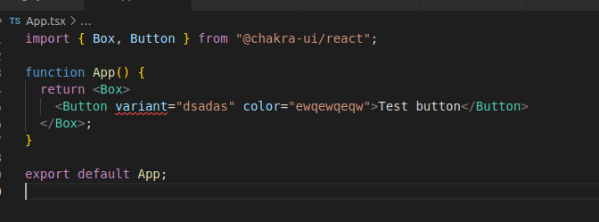
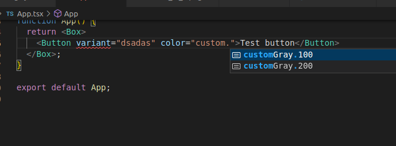

## Reproduction repository for Chakra + Typescript issue

Configuration for described example can be found in this repository. There are a couple of problems, but maybe the configuration isn't correct.

### Chakra CLI tokens with both strict flags and custom colors



With `chakra-cli tokens --strict-component-types --strict-token-types ./theme.ts` The button variant is properly underscored in VS Code, but the color is not. `--strict-token-types` should restrict colors to the ones in `theming.types.d.ts`, right?

What is interesting is that VS Code properly suggests color 'shades':



### ~~Chakra CLI tokens with '--out' flag~~ [fixed in @chakra-ui/cli v2.3.0](https://github.com/chakra-ui/chakra-ui/releases/tag/%40chakra-ui%2Fcli%402.3.0)

~~We can specify the destination directory for `theming.types.d.ts,` but it imports `import { BaseThemeTypings } from "./shared.types.js";` using relative paths, so there is no way to use the option, right? What if I would like to keep the `theming.types.d.ts` in the project, not node_modules?~~

### Typescript for custom theme configuration

How to use Typescript and types from generated files by Chakra CLI in configuration files? For example here: [theme.ts](./theme.ts) I would like to have strict typings for values. For example for colors, I also would like to keep the typings for the structures. Example:

I have:
```typescript
const outline = defineStyle({
  border: '2px dashed',
  borderRadius: 0,
  fontWeight: 'semibold',
  backgroundColor: 'customGrey.200',
  color: 'customGrey.100'
})
```

I would like to be able to do:
```typescript
import { ButtonOutlineVariant } from '@chakra-ui/some-generated-ts-file'; // <== File generated by Chakra CLI

const outline = defineStyle<ButtonOutlineVariant>({
  border: '2px dashed',
  borderRadius: 0,
  fontWeight: 'semibold',
  backgroundColor: 'customGrey.200',
  color: 'customGrey.100'
})
```

And finally, I would like to have strong typings for the structure of this style and also values, like custom colors etc. Is this possible somehow?
